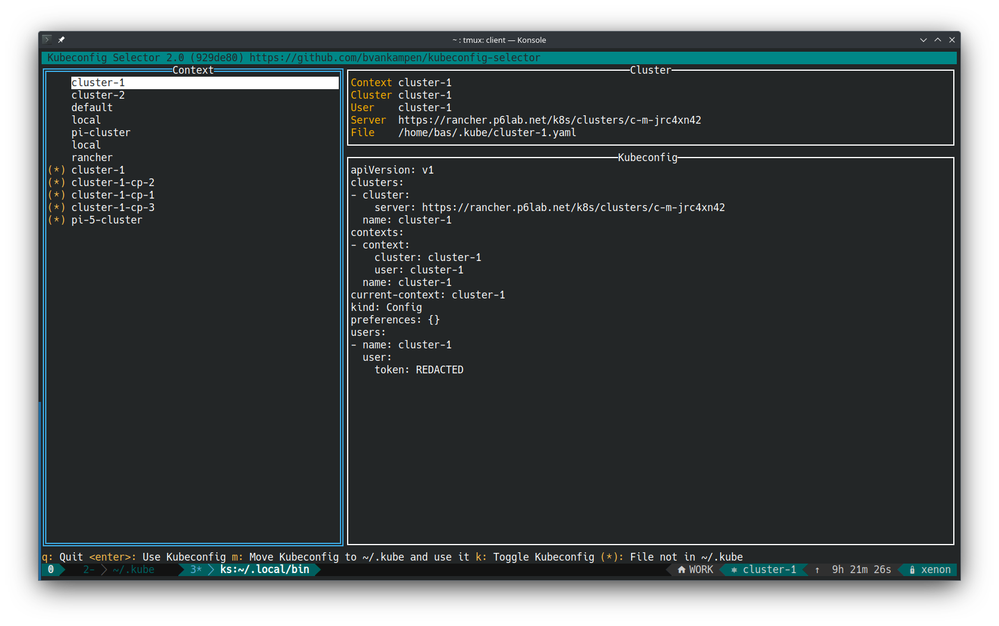

## Simple Kubernetes Kubeconfig Cluster Selector



### Requirements:

- go 1.22

### Usage:
```
NAME:
   cluster - Select kubeconfig

USAGE:
   ks [global options] command [command options] [arguments...]

VERSION:
   2.0 (929de80)

COMMANDS:
   help, h  Shows a list of commands or help for one command

GLOBAL OPTIONS:
   --debug        Enable debug
   --help, -h     show help
   --version, -v  print the version
```
### Build:
`make`
### Install:
`make install`

### Config:

`~/.config/ks.conf`

```
kubeconfigDir: ~/.kube
kubeconfigFile: config
extraKubeconfigDirs:
    - ~/Downloads
showKubeconfig: true
```
