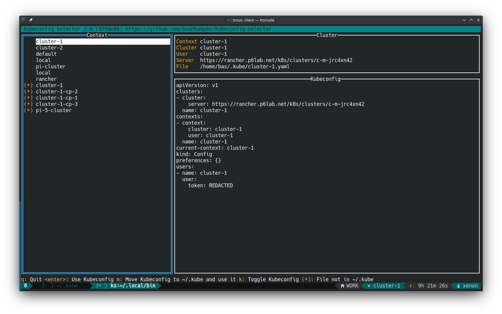

## kubeconfig-selector



### Version: v1.7.0

### Requirements:

- go 1.25

### Usage:

```
NAME:
   ks - Select kubeconfig

USAGE:
   ks [global options] command [command options] [arguments...]

COMMANDS:
   help, h  Shows a list of commands or help for one command

GLOBAL OPTIONS:
   --debug        Enable debug
   --help, -h     show help
   --version, -v  print the version
```

### Build:

`make`

### Install:

`make install`

or download binary in [releases](https://github.com/bvankampen/kubeconfig-selector/releases).

### Config:

`~/.config/ks.conf`

```
kubeconfigDir: ~/.kube
kubeconfigFile: config
extraKubeconfigDirs:
    - ~/Downloads
showKubeconfig: true
createLink: true
rancherFix: true
```

**Note:** On Windows, `createLink: true` requires either running as Administrator or having Developer Mode enabled, because `os.Symlink` needs elevated privileges. If this is not available, set `createLink: false` to use copy mode instead.

### Keybindings:

| Key | Action |
|-----|--------|
| `<enter>` | Use selected kubeconfig |
| `q` | Quit |
| `r` | Rename context (also renames the file) |
| `d` | Delete kubeconfig file |
| `m` | Move kubeconfig to `~/.kube` and use it |
| `k` | Toggle kubeconfig preview |
| `x` | Show downstream clusters (Rancher Manager only) |
| `F5` | Reload kubeconfigs from disk |
| `?` | Help |

### Prefixes:

| Symbol | Meaning |
|--------|---------|
| `*` | Kubeconfig file not in `~/.kube` |
| `r` | Rancher Manager context (server ends with `local`) |

### Rancher downstream clusters:

Press `x` on a Rancher Manager Server to view and download downstream cluster kubeconfigs.

### Fix:

For mitigating these issues:
- https://github.com/rancher/rancher/issues/55031
- https://github.com/rancher/rancher/issues/55034

set configuration variable `rancherFix` to `true`.

**Note:** `rancherFix` only applies to files in `extraKubeconfigDirs` — kubeconfig files
in the primary `kubeconfigDir` (`~/.kube`) are not affected.

### Note:

If the config option `createLink` is set to `true` and the kubeconfig file `~/.kube/config` exists or it's set to `false` and the config file is not managed by ks, then you need to remove the kubeconfig file first. This is a safety measure to not override existing configurations and this file needs to be removed or rename by hand.
